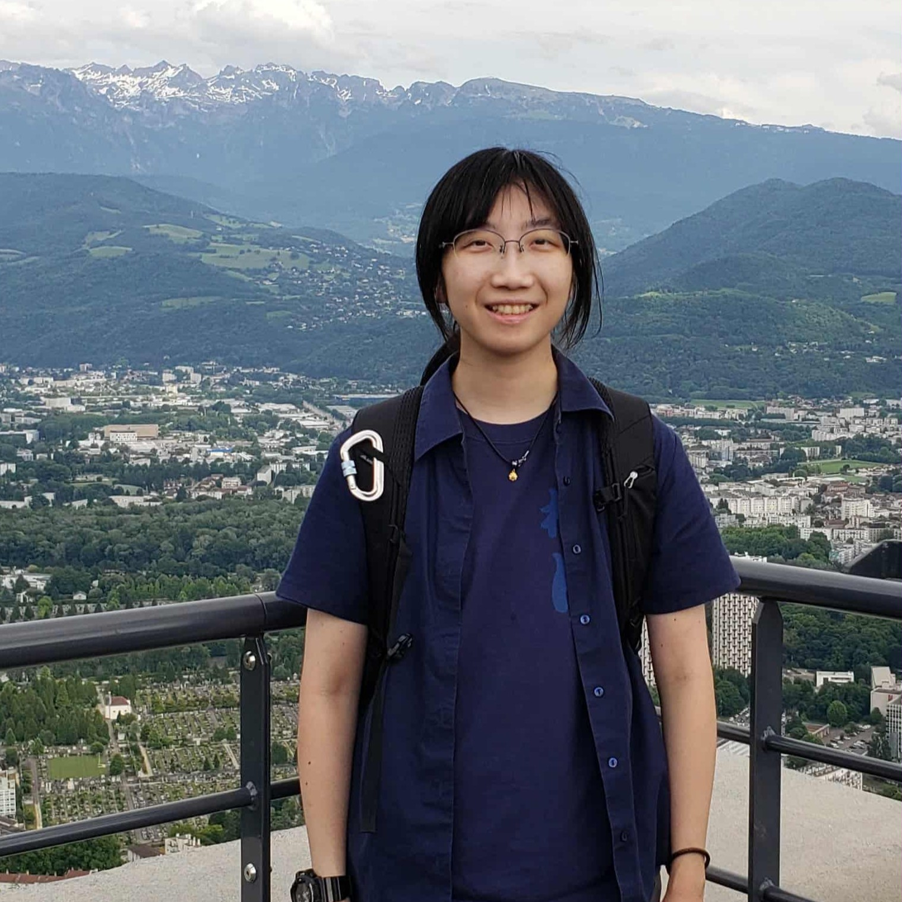

<meta name="viewport" content="width=device-width, initial-scale=1.0">

[HOME](README.md) &emsp; [PROFILE](profile.md) &emsp; [RESEARCH](research.md) &emsp; [CODES](codes.md) &emsp; [PHOTOS](photos.md) &emsp; [CONTACT](contact.md)
 

# Cheryl S. C. Lau

Greetings! I'm a computational astrophysicist and I now work as a postdoc at the National Center for Theoretical Sciences (NCTS-Phys) in Taiwan. 
I recently completed my PhD at the University of St Andrews with Prof. Ian Bonnell, specialising in modelling stellar feedback in molecular clouds. My work primarily involves performing SPH simulations of star-forming environments. 
Previously I obtained my MSc by Research degree at the University of York under the supervision of Dr. Emily Brunsden.
I also completed my BSc at the University of York, because I loved ~~their mallards~~ their physics department.

I am a Hongkonger but I've been living in the UK since 2015. Obsession with cats is usually what I am known for. Drawing is my hobby and I'm a big fan of Japanese anime. Sports are never my thing, the photo above shows a rare sighting of me standing under the sun.  

