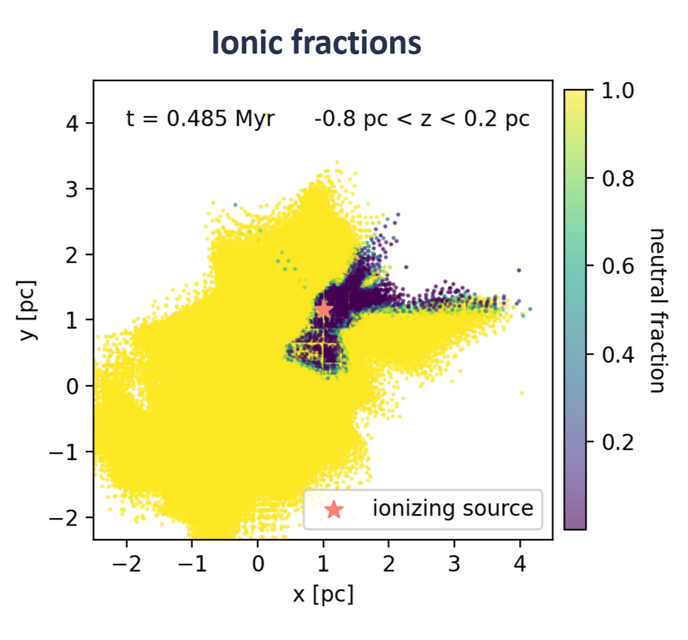
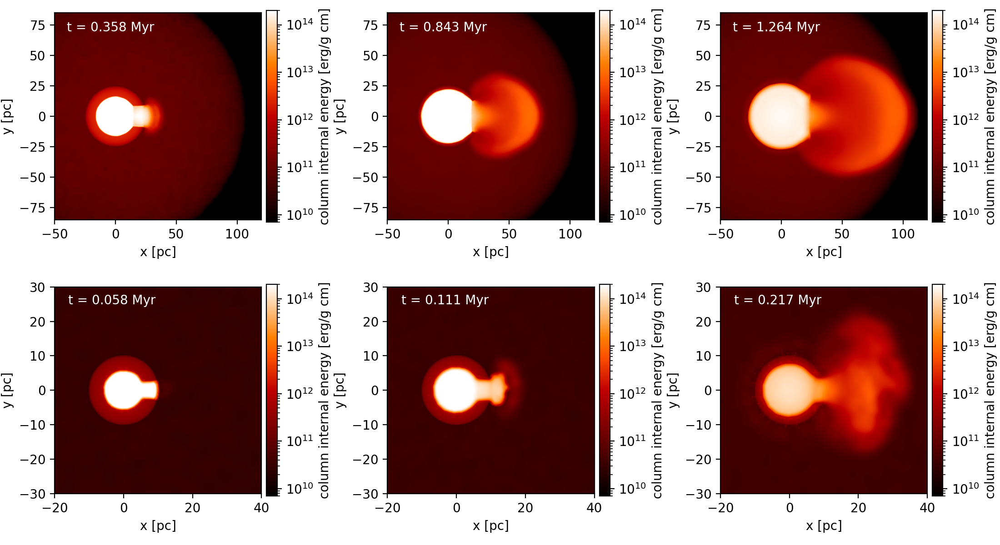
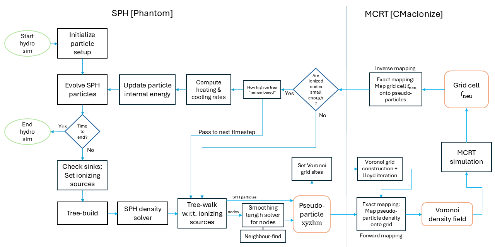

[HOME](README.md) &emsp; [PROFILE](profile.md) &emsp; [RESEARCH](research.md) &emsp; [CODES](codes.md) &emsp; [PHOTOS](photos.md) &emsp; [CONTACT](contact.md)

## Stars, Clouds, and Feedback 

My research revolves around three things: the gaseous environments where stars are born, the stars, and the energy released as they evolve. This energy, known as stellar feedback, in turn shapes the stars' birthplace. 

In fact, star formation is a multi-scale problem. Things going on from the galactic scales down to the scales of accretion discs are interconnected. I'm interested in the intermediate scales - the [Giant Molecular Clouds](https://ui.adsabs.harvard.edu/abs/2023ASPC..534....1C/abstract). They lie along the galactic spiral arms. Turbulent cloud gas collapses under self-gravity to become dense sheets and filaments. Then, when the clumps become sufficiently cold, stars and clusters may begin to form. 

The [initial stellar masses](https://iopscience.iop.org/article/10.1086/376392) generally obey a lognormal distribution, but with a distinct power-law tail. This tail indicates the rare presence of Massive Stars. Despite their small numbers, their feedback dominates the energy budget in our Galaxy. Ionizing radiation, stellar winds and Type II supernovae are all examples of it. Without feedback, stars would form extremely quickly and die out within a very short time. 

**But how much of those feedback energy *actually* went into sustaining the star-forming regions? How do we get the massive stars? Does feedback help or hinder their formation?** These are the kinds of questions to be solved. 

I work on different projects simultaneously ~~or I'll soon become bored~~. Scroll down to see more! 

 
## Massive binary accretion in clusters 

We zoom in a little onto the cores of individual clusters. This is a new project initiated by Ian Bonnell and Jesus (a.k.a. Miguel). The competitive accretion theory (e.g. [Zinnecker 1982](https://doi.org/10.1111/j.1749-6632.1982.tb43399.x), [Bonnell et al. 2001](https://doi.org/10.1046/j.1365-8711.2001.04270.x)) tells us that massive stars tend to form at the central regions of stellar clusters. This is because a cluster's overall gravitational potential can funnel materials towards its centre, allowing the protostars that happened to be sitting there gain advantages in gathering the infalling materials. 

However, whether or not the incoming materials can successfully stick onto the star depends on their relative motions. For instance, their angular momenta need to be sufficiently similar. If the central massive star is stationary, that sets a limit to how much mass it can attain. Now, what if the central star is a massive binary pair with internal angular momentum, and is capable of travelling around in the cluster via N-body dynamics. Will it become even more massive? This is what we're trying to answer. 

 
## Feedback in Giant Molecular Clouds 

Massive stars inject vast amounts of energy and momentum into their surroundings throughout their lifetime. The energy often takes the form of high-energy radiation, that ionizes the nearby H2 molecules and heats them to approximately 10000 K. Meanwhile, stellar winds launched by the radiation pressure can sweep materials into thin dense shells, sculpting voided bubbles in the GMCs. 

It might sound destructive. But in reality, a notable aspect in feedback's behaviour is that they tend to pass through the **paths of least resistance** as they escape their natal GMC. This is much like rivers passing through pre-existing valleys and eventually carving the gorges. If we take a slice from the cloud and plot the location of particles impacted by photoionization (i.e. ionized; coloured in purple), we see that their morphologies clearly exhbit [cavity- and channel-like structures](https://doi.org/10.1093/mnras/staa451). 

Thus, when the progenitor star dies, if the GMC gas is yet to be dispersed (either being too big or is enveloped by warm HI gas), its supernova explosion could be "trapped" in these cavities. Their energies are then swiftly "channelled" out of the GMC, thanks to the early feedback, without significantly impacting the dense star-forming filaments.

Let's look at this example simulation. If we try injecting supernova into a GMC where early photoionization feedback is present, we see that the explosion energy is escaping like blobs running away in bipolar directions. **The explosion is *not* spherically symmetrical.** There are even slight time delays between the shocks! 

We probably need a new model to describe this partial confinement behaviour in the supernova energy release. Why? It's particularly important for galaxy simulations, where sub-grid feedback recipes are crucial. 

### A semi-confined Supernova explosion 

If you think about it, this scenario now becomes fairly analogous to a "semi-confined explosion", a modelling problem that has been well-studied in engineering for decades to understand bomb impact inside buildings. (You might hate engineers but please just read on.) What we could do is to simplify the geometry of this astrophysical problem, and try put the supernovae into spherical clouds with well-defined channel openings. I called this a "semi-confined supernova" model. It allows for a robust study of the impact of confinement by early-feedback-carved bubbles. 

   

With both [analytical and numerical approaches](https://doi.org/10.1093/mnras/staf756), I showed that a semi-confined supernova, compared to a standard symmetrical one, is more capable of sustaining its local dynamical perturbation. It keeps more of its kinetic energy and momentum *locally*, and can induce a higher level of solenoidal turbulence, which is good for regulating star formation. We therefore argue that the semi-confinement effects are highly important in feedback modelling, and we need a way to somehow incorporate it in our sub-grid models! 

 
## Tree-based SPH-MCRT coupled Radiation Hydrodynamics 

Simulation code building is another favourite activity of mine. This project was a continuation of Maya's PhD work, who developed a radiation hydrodynamics (RHD) scheme by coupling [Phantom SPH](https://phantomsph.github.io/) to a grid-based Monte Carlo radiative transfer (MCRT) code [CMacIonize (CMI)](https://github.com/bwvdnbro/CMacIonize) for modelling photoionization. The way it works is to pass the particle properties from SPH over to the MCRT code at each timestep, and run a Monte Carlo simulation by propagating photon packets on the given density field. Once that's completed, the MCRT code computes the steady-state ionic fraction in each grid cell. This information is then returned to the SPH code for heating the particles, and the simulation continues. 

Because the scheme involves transferring fluid densities between SPH particles and Voronoi grid cells, Maya developed the ~~insane~~ [Exact mapping](https://www.sciencedirect.com/science/article/abs/pii/S0021999117307775) method, with which the SPH kernel can be mathematically integrated over the volume of any Voronoi cell. This is an extremely accurate way of mapping interpolated densities between Lagrangian and Eulerian descriptions, only expensive. We need a way to speed it up a little. 

One way to do this is by optimizing the number of particles passed between Phantom and CMI. We only need the ionized regions to be at high resolution, whereas the neutral parts are unimportant as far as mapping is concerned. Like [TreeCol](https://doi.org/10.1111/j.1365-2966.2011.20087.x) or [TreeRay](https://doi.org/10.1093/mnras/sty015), we decided to use the gravity tree. Ionized regions near the stellar sources shall be on particle-level. For the rest, we turn tree nodes into pseudo-particles using adaptive tree-walks, and pass them to CMI instead. Think of it as temporarily tweaking the fluid resolutions, like AMR. 

Photoionization heating and implicit radiative cooling have also been implemented in this RHD scheme. The whole thing now consists of 5 physics modules, and is in my own Phantom fork. The self-invented algorithms are documented in this [paper](https://doi.org/10.1093/mnras/staf366). With the tree, we can achieve up to 100 times speed up. 

